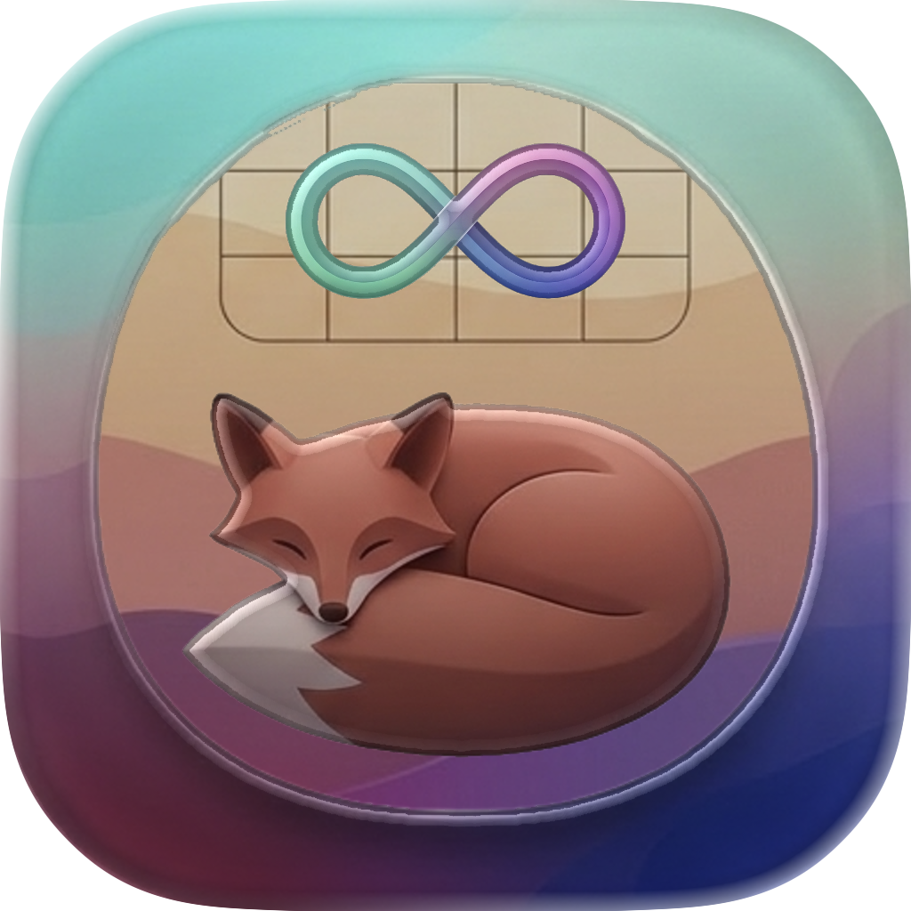

# FoxHole

  

  <strong>A daily focus app designed for the ADHD mind.</strong>

---

## Why FoxHole?

Traditional task managers are overwhelming. Endless lists, infinite scrolling, and the paralysis of too many choices. For those of us with ADHD, these tools often make things worse, not better.

**FoxHole takes a different approach.**

Built by someone who understands the unique challenges of ADHD, FoxHole embraces constraints as a feature, not a limitation. Instead of managing hundreds of tasks, you pick just **three things** for today. That's it.

## Designed for the ADHD Brain

### The 3-Task Limit
Decision fatigue is real. When everything is a priority, nothing is. FoxHole enforces a simple rule: **three tasks per day, maximum**. This isn't a limitation—it's liberation. No more agonizing over what to do next. Pick three, focus, done.

### Built-in Timer with Gentle Nudges
Time blindness is one of the most challenging aspects of ADHD. FoxHole includes a timer that runs alongside your active task, helping you stay aware of passing time. When you exceed your estimate, you get a gentle nudge—not an alarm, not shame, just a friendly "hey, you're still going."

### Always Visible in Your Menu Bar
Out of sight, out of mind? Not anymore. Your current task and elapsed time live in your menu bar, providing a constant (but non-intrusive) reminder of what you're working on.

### Evening Review Ritual
Transitions are hard. FoxHole builds in a structured evening review that helps you:
1. **Close out today** - Celebrate what you finished, gracefully let go of what you didn't
2. **Set up tomorrow** - Pick your three tasks while today is still fresh

No guilt, no shame—just a clean slate for tomorrow.

### Realistic Time Estimates
Choose from preset durations that match how ADHD brains actually work: 15, 25, 45, 60, or 90 minutes. No pretending you'll work for 4 hours straight.

## Features

- **Daily Focus View** - A clean timeline of today's tasks
- **Backlog Management** - A holding pen for future tasks (so you don't forget them)
- **Task Timer** - Track actual time vs. estimated time
- **Menu Bar Integration** - Always know what you're working on
- **Evening Review** - Structured daily planning ritual
- **Completed History** - See your wins and track patterns
- **iCloud Sync** - Your tasks, everywhere

## Requirements

- macOS 14.0 (Sonoma) or later

## Installation

1. Clone the repository
2. Open `FoxHole.xcodeproj` in Xcode
3. Build and run

## Philosophy

FoxHole isn't about productivity hacks or hustle culture. It's about working *with* your brain, not against it. Some days you'll crush all three tasks. Some days you won't. Both are okay.

The goal isn't perfection—it's **intentionality**. Knowing what you're choosing to focus on, one day at a time.

## License

MIT License - See [LICENSE](LICENSE) for details.

---

  <em>Built with focus, for those who struggle to find it.</em>

